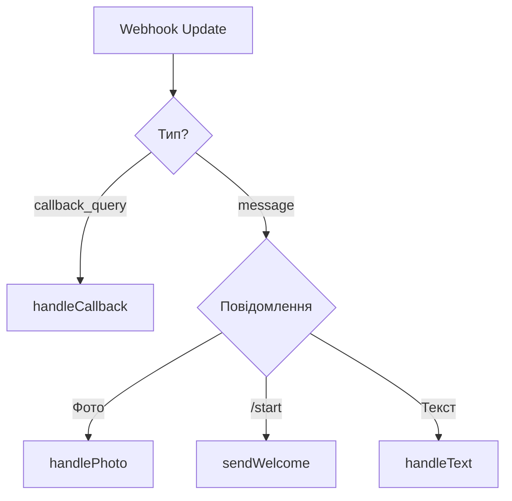
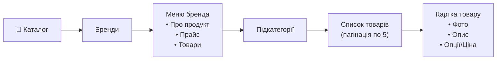
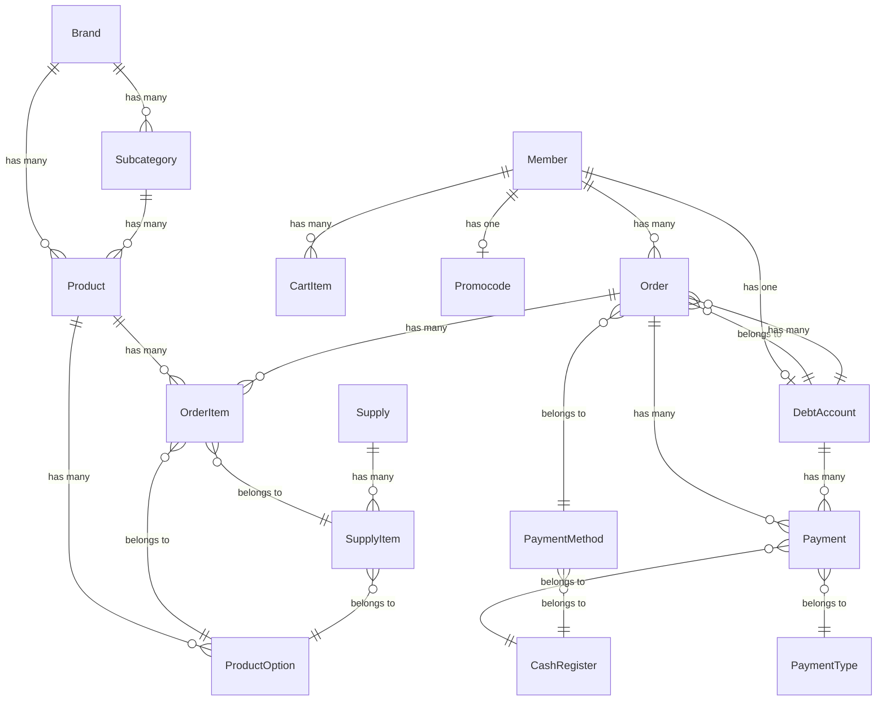

# 🔍 Повний аналіз проекту KratomBot

## Загальний огляд

Це **Laravel 11** додаток — Telegram-бот для інтернет-магазину з адмін-панеллю **Filament v3**. Бот працює як повноцінний e-commerce в Telegram: каталог товарів, кошик, оформлення замовлень, оплата, система знижок та управління боргами клієнтів.

**Стек**: PHP 8.2, Laravel 11, Filament 3, MySQL 8, Docker (Nginx + PHP-FPM), `irazasyed/telegram-bot-sdk` v3.14

---

## 🤖 Telegram Bot — Архітектура та логіка

### Точка входу

Webhook: `POST /telegram/webhook` → [TelegramController.php](file:///Users/foxcreator/work/kratom_bot/app/Http/Controllers/TelegramController.php)

> [!IMPORTANT]
> **TelegramController.php — це МОНОЛІТНИЙ файл на ~1970 рядків**, який містить ВСЮ логіку бота. Це ключовий файл для розуміння проекту.

### Ініціалізація бота

```php
// Конструктор
$this->telegram = new Api(env('TELEGRAM_BOT_TOKEN'));
$this->settings = app(TelegramSettings::class);
```

Бот токен: з `.env` (`TELEGRAM_BOT_TOKEN`).  
Налаштування: через **Spatie Laravel Settings** ([TelegramSettings.php](file:///Users/foxcreator/work/kratom_bot/app/Settings/TelegramSettings.php)).

### Обробка вхідних повідомлень

Webhook обробляє **два типи** updates:



### Головне меню бота

Кнопки reply-клавіатури (`getMainMenuKeyboard`):

| Кнопка | Дія |
|--------|-----|
| 📂 Каталог | Список брендів → підкатегорії → товари |
| 🔥 Топ продажів | Товари з `is_top_sales = true` |
| 🎁 Отримай знижку | Текст з налаштувань + інфо про знижку за підписку |
| 📘 Як замовити | Текст з налаштувань |
| 💳 Оплата | Текст з налаштувань |
| 🛒 Кошик (N) | Перегляд кошика з кількістю товарів |
| ⭐️ Відгуки | Текст з налаштувань |

### Система навігації (History Stack)

Бот реалізує **стек навігації** через `member.ui_state` JSON-поле:

```php
pushHistory($member)     // Зберігає поточний стан в стек
setCurrentState($member) // Встановлює поточний стан
popHistory($member)      // Повертає попередній стан зі стеку
```

**Типи станів**: `main`, `catalog`, `brand`, `subcategory`, `subcategory_products`, `product_card`, `option`, `cart`, `top`, `moringa`

### Каталог товарів



**Пагінація**: Товари в підкатегорії відображаються **по 5 штук** (`PRODUCTS_PER_PAGE = 5`) з inline-кнопками навігації.

### 🛒 Система кошика

| Модель | Файл | Опис |
|--------|------|------|
| CartItem | [CartItem.php](file:///Users/foxcreator/work/kratom_bot/app/Models/CartItem.php) | Товар у кошику (member_id, product_id, product_option_id, quantity) |

**Функціонал кошика**:
- `addToCart($chatId, $productId)` — додавання товару (з дубль-захистом)
- `addToCartOption($chatId, $optionId)` — додавання конкретної опції товару
- `removeFromCart($chatId, $itemId)` — видалення з кошика
- `changeQuantity($chatId, $itemId, $change)` — зміна кількості (± 1)
- `clearCart($chatId)` — очищення з підтвердженням
- `showCart($chatId)` — відображення кошика з inline-кнопками

**Знижка за підписку**: Якщо клієнт підписаний на Telegram-канал (`isUserSubscribedToChannel`), застосовується знижка `telegram_channel_discount` %.

### 💳 Оформлення замовлення (Checkout Flow)

Стан оформлення зберігається у `member.checkout_state` (JSON):

```mermaid
flowchart TD
    START[checkoutCart] --> CHECK{Є активні замовлення?}
    CHECK -->|Так| BLOCK["⏳ Блокуємо<br/>(1 активне замовлення)"]
    CHECK -->|Ні| PAY[Вибір способу оплати]
    PAY -->|PaymentMethod| PM["startPaymentMethodCheckout<br/>• Показ реквізитів<br/>• Очікування фото квитанції"]
    PAY -->|Передплата| PP["startPrepaidCheckout<br/>• Показ реквізитів<br/>• Очікування фото"]
    PAY -->|Накладений платіж<br/>(тільки 1-е замовлення)| COD[startCodCheckout]
    PM --> PHOTO[handlePhoto → зберігаємо квитанцію]
    PP --> PHOTO
    PHOTO --> PHONE["AWAIT_SHIPPING_PHONE<br/>Ввід телефону"]
    COD --> PHONE
    PHONE --> CITY["AWAIT_SHIPPING_CITY<br/>Ввід міста"]
    CITY --> OFFICE["AWAIT_SHIPPING_OFFICE<br/>Номер відділення НП"]
    OFFICE --> NAME["AWAIT_SHIPPING_NAME<br/>ПІБ отримувача"]
    NAME --> FINALIZE["finalizeOrder<br/>• Створює Order + OrderItems<br/>• Очищає кошик<br/>• Надсилає нотифікацію"]
```

**Ключові стани** (enum `CHECKOUT_STATE`):
- `AWAIT_PAYMENT_TYPE` → `AWAIT_RECEIPT_PHOTO` → `AWAIT_SHIPPING_PHONE` → `AWAIT_SHIPPING_CITY` → `AWAIT_SHIPPING_OFFICE` → `AWAIT_SHIPPING_NAME`

**Два способи покупки**:
1. **Через кошик** (`checkoutCart`) — підтримує `PaymentMethod`
2. **Миттєва покупка** (`checkoutDirectProduct`/`checkoutDirectProductOption`) — підтримує старий flow (Передплата/Накладений)

### 📨 Нотифікації

Два сервіси для відправки повідомлень:

| Сервіс | Файл | Призначення |
|--------|------|-------------|
| TelegramService | [TelegramService.php](file:///Users/foxcreator/work/kratom_bot/app/Services/TelegramService.php) | Прості повідомлення через SDK |
| TelegramOrderNotifier | [TelegramOrderNotifier.php](file:///Users/foxcreator/work/kratom_bot/app/Http/Services/TelegramOrderNotifier.php) | Нотифікація про нове замовлення в групу |

> [!WARNING]
> **TelegramOrderNotifier** має **hardcoded** bot token і chat_id прямо в конструкторі:
> ```php
> $this->botToken = '7626235994:AAHhZOotdkoS5sH9orUTJcg7tZyMDc5OXws';
> $this->chatId = '-1003024012905';
> ```
> Це **окремий бот** від основного (основний: `7482095159:...`). Токени не повинні бути в коді!

### 🧹 Система очищення чату

Бот реалізує **автоматичне видалення попередніх повідомлень** для чистоти чату:

- `sendMessageWithCleanup()` — перед кожним повідомленням видаляє попередні
- `deletePreviousMessages()` — видаляє повідомлення бота і користувача
- `saveMessageId()` / `saveUserMessageId()` — зберігає ID для видалення
- Обмеження: зберігається максимум 10 ID повідомлень користувача

---

## 📊 Моделі даних та зв'язки



### Ключові моделі

| Модель | Файл | Опис |
|--------|------|------|
| [Member](file:///Users/foxcreator/work/kratom_bot/app/Models/Member.php) | Клієнт Telegram | telegram_id, username, full_name, checkout_state (JSON), ui_state (JSON), current_brand_id |
| [Order](file:///Users/foxcreator/work/kratom_bot/app/Models/Order.php) | Замовлення | 7 статусів (new→completed/cancelled), знижки, доставка НП, фінансові поля |
| [Payment](file:///Users/foxcreator/work/kratom_bot/app/Models/Payment.php) | Платіж | Готівка/Списання з балансу, прив'язка до каси та замовлення, авто-розподіл |
| [DebtAccount](file:///Users/foxcreator/work/kratom_bot/app/Models/DebtAccount.php) | Борговий рахунок | total_debt, paid_amount, remaining_debt, balance |
| [Product](file:///Users/foxcreator/work/kratom_bot/app/Models/Product.php) | Товар | name, price, brand, subcategory, is_top_sales, is_visible |
| [ProductOption](file:///Users/foxcreator/work/kratom_bot/app/Models/ProductOption.php) | Варіант товару | name, price, in_stock, current_quantity |
| [Brand](file:///Users/foxcreator/work/kratom_bot/app/Models/Brand.php) | Бренд/Категорія | name, description, price, chat_text |
| [Subcategory](file:///Users/foxcreator/work/kratom_bot/app/Models/Subcategory.php) | Підкатегорія | name, brand_id |

### Фінансова система

Проект має складну фінансову логіку:

1. **Order → автоматично створює DebtAccount** для кожного клієнта
2. **Payment → автоматично оновлює DebtAccount та Order** (через model events)
3. **Статус замовлення** оновлюється автоматично при зміні `paid_amount` / `remaining_amount`
4. **Залишки коштів** клієнта зберігаються в `DebtAccount.balance`
5. **Списання з балансу** — окремий тип оплати
6. **InventoryService** — FIFO списання товарів з партій поставок

---

## 🏗 Filament Адмін-панель

### Ресурси (CRUD)

| Ресурс | Файл | Опис |
|--------|------|------|
| [OrderResource](file:///Users/foxcreator/work/kratom_bot/app/Filament/Resources/OrderResource.php) | 35KB (!) | Управління замовленнями |
| [PaymentResource](file:///Users/foxcreator/work/kratom_bot/app/Filament/Resources/PaymentResource.php) | 16KB | Управління платежами |
| [DebtAccountResource](file:///Users/foxcreator/work/kratom_bot/app/Filament/Resources/DebtAccountResource.php) | 11KB | Управління боргами |
| [MemberResource](file:///Users/foxcreator/work/kratom_bot/app/Filament/Resources/MemberResource.php) | 7.7KB | Клієнти |
| [ProductResource](file:///Users/foxcreator/work/kratom_bot/app/Filament/Resources/ProductResource.php) | 5.8KB | Товари |
| [PaymentMethodResource](file:///Users/foxcreator/work/kratom_bot/app/Filament/Resources/PaymentMethodResource.php) | 4.7KB | Способи оплати |
| [CashRegisterResource](file:///Users/foxcreator/work/kratom_bot/app/Filament/Resources/CashRegisterResource.php) | 4KB | Каси |
| [BrandResource](file:///Users/foxcreator/work/kratom_bot/app/Filament/Resources/BrandResource.php) | 3KB | Бренди |
| [SubcategoryResource](file:///Users/foxcreator/work/kratom_bot/app/Filament/Resources/SubcategoryResource.php) | 3.1KB | Підкатегорії |
| [UserResource](file:///Users/foxcreator/work/kratom_bot/app/Filament/Resources/UserResource.php) | 3.5KB | Користувачі адмінки |
| [SupplyResource](file:///Users/foxcreator/work/kratom_bot/app/Filament/Resources/SupplyResource.php) | 2.8KB | Поставки |
| [StockResource](file:///Users/foxcreator/work/kratom_bot/app/Filament/Resources/StockResource.php) | 2.5KB | Склад |
| [CashWithdrawalResource](file:///Users/foxcreator/work/kratom_bot/app/Filament/Resources/CashWithdrawalResource.php) | 3.2KB | Зняття коштів |
| [PaymentTypeResource](file:///Users/foxcreator/work/kratom_bot/app/Filament/Resources/PaymentTypeResource.php) | 2.7KB | Типи оплат |

### Сторінки

- [ManageTelegram](file:///Users/foxcreator/work/kratom_bot/app/Filament/Pages/ManageTelegram.php) — сторінка налаштувань бота (Spatie Settings)

### Віджети дашборду

- [StatsOverview](file:///Users/foxcreator/work/kratom_bot/app/Filament/Widgets/StatsOverview.php) — загальна статистика
- [SalesChart](file:///Users/foxcreator/work/kratom_bot/app/Filament/Widgets/SalesChart.php) — графік продажів
- [DailySalesChart](file:///Users/foxcreator/work/kratom_bot/app/Filament/Widgets/DailySalesChart.php) — денний графік
- [MemberFinancialInfo](file:///Users/foxcreator/work/kratom_bot/app/Filament/Widgets/MemberFinancialInfo.php) — фінансова інфо клієнта

---

## 🐳 Docker — Аналіз та виправлення помилки

### Поточна структура

```
docker/
├── Nginx.Dockerfile   — Nginx (без тегу! FROM nginx)
├── fpm.Dockerfile     — PHP 8.2-fpm-alpine + розширення + Composer
├── composer.Dockerfile — composer (для install)
├── conf/
│   ├── php.ini         — upload_max_filesize = 20M
│   └── vhost.conf      — Nginx конфігурація
```

### Помилка `Failed to decode zlib stream`

> [!CAUTION]
> Помилка в [fpm.Dockerfile](file:///Users/foxcreator/work/kratom_bot/docker/fpm.Dockerfile) на рядку 24:
> ```dockerfile
> RUN curl -sS https://getcomposer.org/installer | php -- --install-dir=/usr/local/bin --filename=composer
> ```
> Помилка `Failed to decode zlib stream` відбувається через:
> 1. **На Alpine відсутній `oniguruma` та `zlib` dev-пакети** для коректної роботи `php` при завантаженні Composer
> 2. **`curl` на Alpine** може мати проблеми з великими downloads без `ca-certificates`
> 3. **Мережева нестабільність** або обрізання завантаження через таймаут

### Рекомендоване виправлення `fpm.Dockerfile`:

```dockerfile
FROM php:8.2-fpm-alpine

COPY docker/conf/php.ini /usr/local/etc/php/conf.d/php.ini

# Пакети для розширень + certifікати
RUN apk add --no-cache \
    icu-dev \
    libzip-dev \
    zip \
    unzip \
    libxml2-dev \
    freetype-dev \
    libjpeg-turbo-dev \
    libpng-dev \
    ca-certificates \
    curl \
    && docker-php-ext-configure gd --with-freetype --with-jpeg \
    && docker-php-ext-install -j$(nproc) \
        pdo \
        pdo_mysql \
        bcmath \
        intl \
        gd \
        zip

# Composer — використовуємо official COPY замість curl
COPY --from=composer:2 /usr/bin/composer /usr/local/bin/composer
```

> [!TIP]
> **Ключове виправлення**: Замість `curl | php` використовуємо `COPY --from=composer:2` — це **multi-stage build** pattern, який:
> - Не залежить від мережі під час білда
> - Не потребує `zlib` для декомпресії
> - Завжди дає останню стабільну версію Composer 2
> - Швидший і надійніший

### Інші проблеми Docker

| Проблема | Файл | Рекомендація |
|----------|------|-------------|
| `FROM nginx` без тегу версії | Nginx.Dockerfile | Зафіксувати: `FROM nginx:1.25-alpine` |
| `FROM composer` без тегу версії | composer.Dockerfile | Зафіксувати: `FROM composer:2` |
| `version: "3.3"` deprecated | docker-compose.yml | Видалити `version` рядок (Docker Compose v2 не потребує) |
| Немає `.dockerignore` | проект root | Додати для прискорення білда |
| Немає health checks | docker-compose.yml | Додати healthcheck для MySQL/FPM |
| `MYSQL_DATABASE=kratombot` vs `.env` `DB_DATABASE=telegram_bot` | docker-compose.yml / .env | **Невідповідність!** Потрібно узгодити |

> [!WARNING]
> **Критична невідповідність БД**: docker-compose створює базу `kratombot`, але `.env.example` налаштований на `telegram_bot`. Це призведе до помилки при підключенні!

---

## 🌐 Маршрути

### Web Routes ([web.php](file:///Users/foxcreator/work/kratom_bot/routes/web.php))

| Маршрут | Контролер | Опис |
|---------|-----------|------|
| `POST /telegram/webhook` | TelegramController@webhook | Webhook бота (без CSRF) |
| `GET /old-admin/setwebhook` | TelegramController@setWebhook | Встановлення webhook URL |
| `/old-admin/*` | Старі адмін-контролери | Стара адмінка (middleware `auth` + `isAdmin`) |

### API Routes ([api.php](file:///Users/foxcreator/work/kratom_bot/routes/api.php))

| Маршрут | Контролер | Опис |
|---------|-----------|------|
| `POST /promocode/check` | PostbackController@check | Перевірка промокоду |
| `POST /promocode/update-status` | PostbackController@updateStatus | Оновлення статусу промокоду |
| `GET /products/{id}/options` | Closure | Отримання опцій товару |

---

## 🔧 Artisan-команди

| Команда | Файл | Опис |
|---------|------|------|
| CheckDebtAccountsStatus | [CheckDebtAccountsStatus.php](file:///Users/foxcreator/work/kratom_bot/app/Console/Commands/CheckDebtAccountsStatus.php) | Перевірка статусів боргів |
| CheckPromoCodes | [CheckPromoCodes.php](file:///Users/foxcreator/work/kratom_bot/app/Console/Commands/CheckPromoCodes.php) | Перевірка промокодів |
| ClearAllOrders | [ClearAllOrders.php](file:///Users/foxcreator/work/kratom_bot/app/Console/Commands/ClearAllOrders.php) | Очищення замовлень (dev) |
| ClearSuppliesAndStock | [ClearSuppliesAndStock.php](file:///Users/foxcreator/work/kratom_bot/app/Console/Commands/ClearSuppliesAndStock.php) | Очищення складу (dev) |
| CreateDebtAccountsForExistingMembers | [CreateDebtAccounts...](file:///Users/foxcreator/work/kratom_bot/app/Console/Commands/CreateDebtAccountsForExistingMembers.php) | Створення боргових акаунтів |
| CreateTestOrders | [CreateTestOrders.php](file:///Users/foxcreator/work/kratom_bot/app/Console/Commands/CreateTestOrders.php) | Тестові замовлення |
| FixImageUrls | [FixImageUrls.php](file:///Users/foxcreator/work/kratom_bot/app/Console/Commands/FixImageUrls.php) | Виправлення URL зображень |
| MigrateTelegramSettings | [MigrateTelegramSettings.php](file:///Users/foxcreator/work/kratom_bot/app/Console/Commands/MigrateTelegramSettings.php) | Міграція налаштувань Telegram |

---

## ⚠️ Виявлені проблеми та code smells

### Критичні

1. **🔒 Hardcoded секрети в коді**
   - [TelegramOrderNotifier.php:14-15](file:///Users/foxcreator/work/kratom_bot/app/Http/Services/TelegramOrderNotifier.php#L14-L15) — bot token та chat_id прямо в коді
   - [.env.example:65](file:///Users/foxcreator/work/kratom_bot/.env.example#L65) — **реальний** bot token в example файлі

2. **🗃 God-object контролер** — TelegramController.php (1969 рядків) — містить всю логіку бота в одному файлі

3. **📦 Невідповідність імен БД** — docker-compose.yml: `kratombot` vs .env: `telegram_bot`

### Серйозні

4. **Debug залишки в коді** — [TelegramController.php:676](file:///Users/foxcreator/work/kratom_bot/app/Http/Controllers/TelegramController.php#L676): `Log::info('fucking fuck');`

5. **Дублювання логіки checkout** — `checkoutDirectProduct` і `checkoutDirectProductOption` дублюють ~90% коду `checkoutCart`

6. **env() в runtime** — `env()` використовується безпосередньо в конструкторі контролера замість `config()`

7. **Множинні виклики `Telegram::getWebhookUpdates()`** — один и той самий update парситься кілька разів у різних методах

### Рекомендації з покращення

8. **Немає Rate Limiting** для webhook
9. **Немає валідації телефону** при checkout
10. **Немає черги** (Queue) для відправки Telegram повідомлень — все синхронно
11. **Тести** — тестів для бота немає (TESTING_GUIDE.md описує лише загальну структуру)
12. **Дублювання `phone`** в `Member.fillable` — поле `phone` вказано двічі

---

## 📁 Повна структура проекту

```
kratom_bot/
├── app/
│   ├── Console/Commands/          # 8 artisan-команд
│   ├── Filament/
│   │   ├── Pages/ManageTelegram.php
│   │   ├── Resources/             # 14 CRUD-ресурсів
│   │   └── Widgets/               # 4 віджети дашборду
│   ├── Http/
│   │   ├── Controllers/
│   │   │   ├── TelegramController.php  # 🤖 ГОЛОВНИЙ: вся логіка бота
│   │   │   ├── Admin/                  # 9 контролерів старої адмінки
│   │   │   ├── Api/PostbackController.php  # API промокодів
│   │   │   └── HomeController.php
│   │   ├── Services/TelegramOrderNotifier.php  # Нотифікація замовлень
│   │   └── Middleware/
│   ├── Models/                    # 21 модель
│   ├── Providers/
│   ├── Services/
│   │   ├── TelegramService.php    # Простий сервіс відправки
│   │   └── InventoryService.php   # FIFO складський облік
│   └── Settings/TelegramSettings.php  # Spatie Settings
├── config/telegram.php            # Конфіг SDK
├── database/
│   ├── migrations/                # 53 міграції
│   └── settings/                  # Spatie settings міграції
├── docker/                        # Docker файли
├── routes/
│   ├── web.php                    # Webhook + стара адмінка
│   └── api.php                    # API промокодів
├── docs/                          # Документація
└── docker-compose.yml
```
